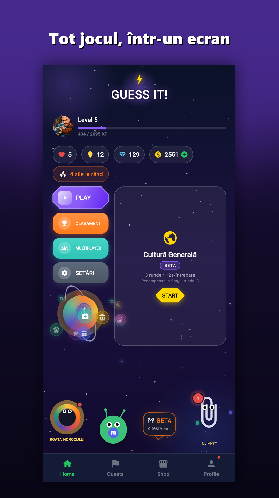
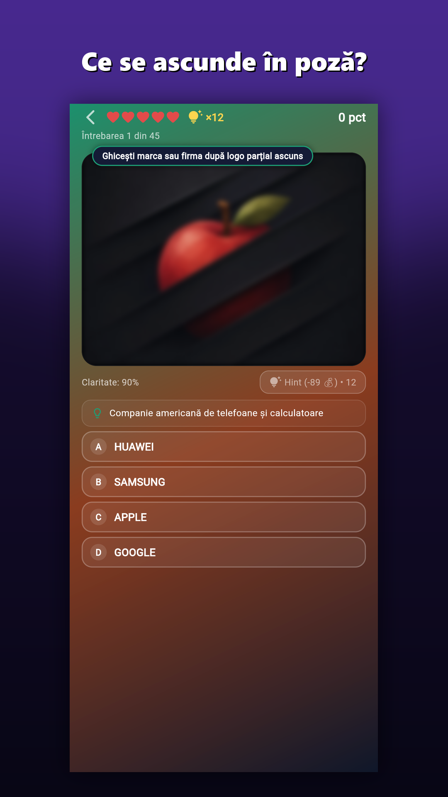
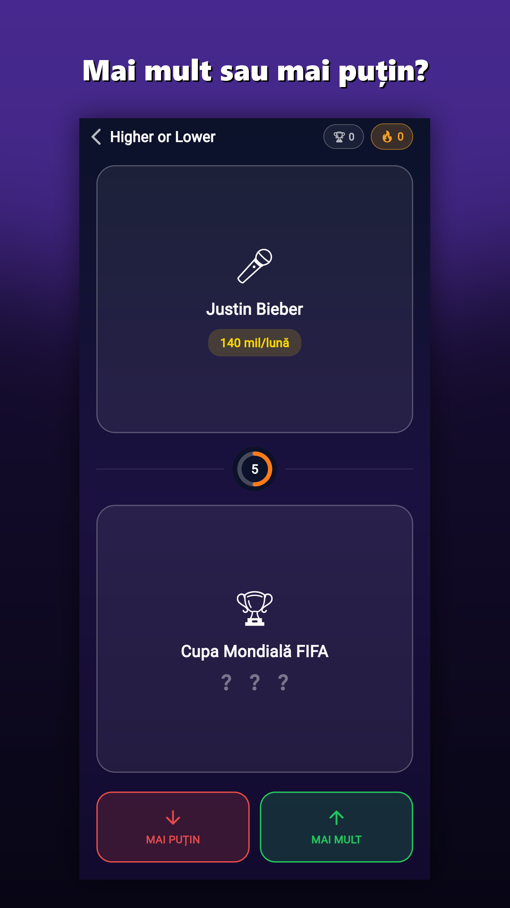
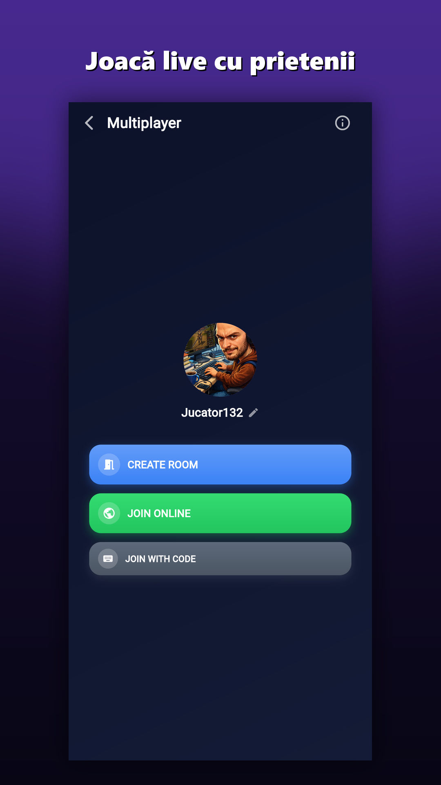

# SodoQuizz

**Vezi o poză neclară. Ai patru variante. Cât de repede îți dai seama ce e?**

SodoQuizz este un joc de cultură generală în limba română, construit în
Flutter, cu backend Firebase. Imaginea fiecărei întrebări se limpezește
treptat pe măsură ce folosești indicii; cu cât răspunzi mai devreme, cu atât
primești mai multe puncte.

**Joacă direct din browser:** https://rocketknife1.github.io/SodoQuizz/
&nbsp;·&nbsp; Android: în testare pe Google Play

<p>
  
  
  
  
</p>

## Conținut

1.494 de întrebări în 15 categorii: logo-uri, desene animate și filme, jocuri
video, mașini, celebrități, sport, monumente, animale, steaguri, instrumente
muzicale, obiecte medicale, piese auto, aplicații de telefon, România și
Matematică (formule și matematicieni, fără poze).

## Moduri de joc

- **Categorii** – mecanica de bază: poză neclară, patru variante, indicii.
- **Higher or Lower** – ghicești care dintre două subiecte e mai căutat.
- **Cultură Generală** – trei runde contra cronometrului.
- **Provocarea Zilei** – aceleași cinci întrebări pentru toți, cu clasament zilnic.
- **Provoacă un prieten** – rezolvi un set de întrebări, trimiți un link, iar
  prietenul primește exact aceleași întrebări; câștigă scorul mai mare.
- **Multiplayer în timp real** – camere cu cod sau meci rapid cu adversari
  reali, în șase moduri: Clasic, Higher & Lower, Quizz Tanks, Obby,
  Piatră-Hârtie-Foarfecă și Scaunul Electric.
- **Joacă cu boți** – modurile de multiplayer, offline, cu 1–6 boți și
  dificultate reglabilă.

## Progresie

Niveluri și XP, quest-uri zilnice, realizări, ligi lunare cu recompense de
sezon, rating Elo în multiplayer, roata norocului, magazin și cosmetice
(rame de avatar, titluri). Contul se poate lega de Google, iar progresul se
sincronizează în cloud.

## Tehnologii

| Zonă | Ce folosește |
|---|---|
| Aplicație | Flutter / Dart (Android + Web) |
| Date și conturi | Firebase Auth, Cloud Firestore, Cloud Functions |
| Securitate | Firebase App Check, reguli Firestore testate automat |
| Notificări | Firebase Cloud Messaging, notificări locale |
| Monitorizare | Crashlytics, Analytics, Remote Config |
| Monetizare | AdMob, achiziții în aplicație validate pe server |
| Livrare | GitHub Actions → GitHub Pages (versiunea web) |

## Structura proiectului

```
lib/
  core/       regulile jocului: moduri, scor, progresie, economie
  data/       servicii: stocare locală, Firestore, multiplayer, notificări
  models/     modelele de date
  screens/    câte un fișier per ecran; multiplayer/ și admin/ grupate
  widgets/    componente reutilizabile
assets/continut/<categorie>/   intrebari.json + poze/
functions/    Cloud Functions (notificări, validarea achizițiilor)
test/         teste unitare, de widget și pentru regulile Firestore
tools/        scripturi pentru conținut (întrebări, poze, sunete) și administrare
```

## Rulare locală

```
flutter pub get
flutter analyze
flutter test
flutter run -d chrome
```

Instrucțiunile de build pentru Android și publicare sunt în
[docs/build.md](docs/build.md).

## Feedback

Jocul e în beta. Erorile și ideile se pot trimite pe Discord:
https://discord.gg/V7Kmcgbg7
